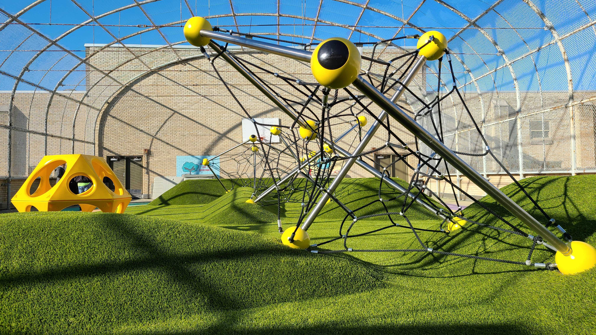

# About

## About Our School

Welcome to GW Childs School, a cornerstone of education in the Point Breez neighborhood of Philadelphia!

Our public school takes pride in its rich history, diverse community, and commitment to fostering academic achievement. Our school providers a nurturing environment where students are empowered to learn, grow, and achieve their full potential.

Explore our website to discover the unique programs, dedicated faculty, and exciting opportunities that make GW Childs a place where education meets inspiration,. Join us on this educational journey, where we celebrate diversity, embrace creativity, and cultivate the leaders of tomorrow.

## About Our HSA

Welcome to GW Childs HSA community! We are a [Home and School Association](https://www.philadelphiahsc.org) made up of a passionate group of parents, teachers, and staff dedicated to enhancing the educational experience for our students. Together, we foster a supportive environment that encourages collaboration and communication between home and school.

Explore our website to learn more about our initiatives, events, and how you can get involved. Join us in making a positive impact on the education and well-being of our children.

## Resources

### For Current Families
- Parent and Student Handbook: [GW Childs Parent Student Handbook](https://drive.google.com/file/d/1BFfvYKutHWljt8ZoSxSvn3yS9qxEEb4d/view?usp=share_link)
- Staff email addresses

### For Prospective Families
- District Enrollment Guidelines: [Enrollment Guidelines](https://docs.google.com/document/d/1tJ7D8uMQkuzOrQ971QEi43VfNiR83G8SesC4js8geMs/edit?usp=sharing)
- Link for student enrollment: